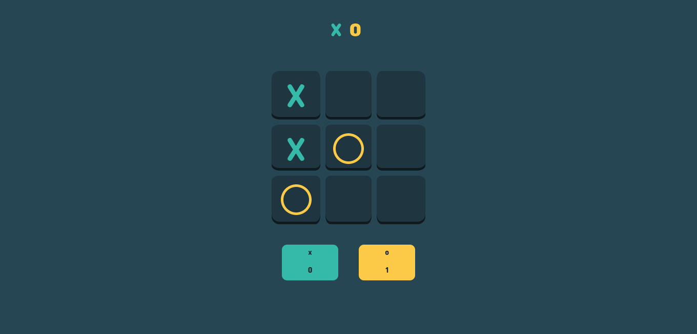

# 🎮 Tic Tac Toe

Jogo da velha simples construído usando HTML, CSS e JavaScript.

Opções de jogo:

- 🧑🏼‍🤝‍🧑🏼 2 jogadores;
- 🤖 Contra IA;

[🔗 Clique aqui para acessar](https://danielemarii.github.io/ticTacToe-js/)

## ⚒️ Ferramentas 

- HTML
- CSS
- JAVASCRIPT

